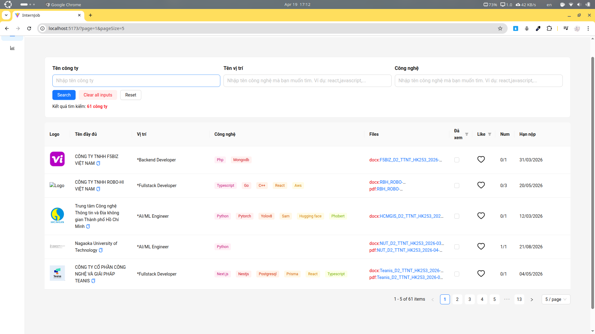

# InternJob - AI-Powered Internship Tracker

## Motivation

This project was built to address the usability issues of my university's official internship recruitment portal:

- **Unstable ordering**: Company list order changes randomly on every page refresh, making it impossible to track which companies were reviewed
- **No tracking mechanism**: No way to mark companies as "viewed" or "liked" for future reference
- **Limited search**: No filtering by job position or tech stack, forcing students to manually scan through every listing

InternJob solves these problems by providing a stable, searchable dashboard with personal tracking features, plus AI-powered extraction of job details from PDF/DOCX files.

The original link for my university's official internship recruitment portal: https://internship.cse.hcmut.edu.vn/

---

## Overview

A full-stack web application that uses **Google Gemini AI** to automatically extract structured job information from PDF/DOCX files, helping students track and manage internship opportunities.

## Tech Stack

| Frontend                  | Backend             |
| ------------------------- | ------------------- |
| React 19 + TypeScript     | NestJS + TypeScript |
| Vite                      | MongoDB + Mongoose  |
| Ant Design + Tailwind CSS | Google Gemini AI    |
| TanStack Query v5         | PDF/DOCX Processing |

## Key Features

- **AI Document Processing**: Upload job PDF/DOCX → Gemini extracts positions, tech stacks, requirements
- **Smart Dashboard**: Filter by tech stack, view status, like/save companies
- **Optimistic UI**: Instant feedback with rollback on error
- **URL-based Filters**: Shareable filter states via query params
- **Auto Crawl**: Scheduled scraping to keep data fresh

## Highlights

- Implemented **TanStack Query v5** optimistic mutations with proper `queryClient` context
- Built reusable filter system with URL synchronization
- Integrated Gemini File API for multi-document AI processing with retry logic

## Quick Start

```bash
# Frontend
cd frontend && npm install && npm run dev

# Backend
cd backend && npm install
docker compose up -d
npm run start:dev
```

## Demo



---
